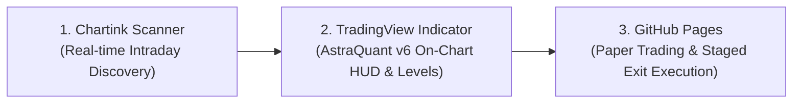

# Astra Quant • Chartink 10-Framework Screener Setup Guide

This guide provides the official copy-paste syntax and configuration instructions to set up the **Astra Quant 10-Framework Institutional Breakout Engine** on **[Chartink.com](https://chartink.com)**.

---

## 1. Overview & Institutional Workflow

While our **GitHub Pages Screener** provides deep forensic audits (Demat delivery %, RS ranking, and historical replay) and our **TradingView Pine Script v6** provides on-chart visual execution, **Chartink** serves as the **real-time intraday scanner** to discover candidate breakouts during market hours (9:15 AM – 3:30 PM IST).



---

## 2. Master Confluence Screener: "Fortified Institutional Breakout"

This master query combines **Stan Weinstein Stage 2**, **Minervini SEPA Trend**, **VCP Volatility Contraction**, **Wyckoff Supply Absorption**, and **Overhead Ceiling Protection** into a single scanner:

### Copy-Paste Query Syntax:
```text
[0] 5 minute Volume * [0] 5 minute Close >= 50000000 
AND [0] day Close > [0] day Sma(Close, 50) 
AND [0] day Sma(Close, 50) > [0] day Sma(Close, 200) 
AND [0] day Sma(Close, 200) >= [-20] day Sma(Close, 200) * 0.99 
AND [0] day Close >= 1.30 * [0] day Min(252, Low) 
AND [0] day Close >= 0.75 * [0] day Max(252, High) 
AND [0] day Close / [0] day Sma(Close, 50) <= 1.20 
AND [0] day Close > [-1] day Max(20, High) 
AND [0] day Volume >= 1.4 * [0] day Sma(Volume, 20) 
AND ( [0] day Max(20, High) - [0] day Min(20, Low) ) / [0] day Close <= 0.15 
AND ( [0] day Close - [0] day Low ) / ( [0] day High - [0] day Low ) >= 0.60 
AND ( [0] day Max(50, High) <= [-1] day Max(20, High) * 1.02 OR [0] day Close >= [0] day Max(50, High) )
```

---

## 3. Individual Strategy Filters for Chartink

### 1. 🎯 Sniper Mode (Ultra-High Conviction, 65%+ Win Rate)
*Requires Stage 2 uptrend, tight 10-day contraction, high closing range (Wyckoff absorption), volume ignition, and anti-extension gate:*
```text
[0] day Close > [0] day Sma(Close, 50) 
AND [0] day Sma(Close, 50) > [0] day Sma(Close, 200) 
AND [0] day Close / [0] day Sma(Close, 50) <= 1.15 
AND ( [0] day Max(10, High) - [0] day Min(10, Low) ) / [0] day Close <= 0.08 
AND [0] day Volume >= 1.5 * [0] day Sma(Volume, 20) 
AND ( [0] day Close - [0] day Low ) / ( [0] day High - [0] day Low ) >= 0.65 
AND [0] day Close > [-1] day Max(10, High) 
AND ( [0] day Max(50, High) <= [-1] day Max(20, High) * 1.02 OR [0] day Close >= [0] day Max(50, High) )
```

---

### 2. 🛡️ Protocol Fortified Breakout
*Requires moving average stack, breakout of 20-day high with ATR clearance, anti-chase cap $\le 20\%$ above 50 SMA, and volume surge:*
```text
[0] day Close > [0] day Sma(Close, 50) 
AND [0] day Sma(Close, 50) > [0] day Sma(Close, 200) 
AND [0] day Close / [0] day Sma(Close, 50) <= 1.20 
AND [0] day Close > [-1] day Max(20, High) 
AND [0] day Volume >= 1.3 * [0] day Sma(Volume, 20) 
AND ( [0] day Max(50, High) <= [-1] day Max(20, High) * 1.02 OR [0] day Close >= [0] day Max(50, High) )
```

---

### 3. ⚡ Relative Strength Leader (William O'Neil RS Outperformer)
*Scans for stocks trading well above their 200-day baseline with volume support:*
```text
[0] day Close > [0] day Sma(Close, 50) 
AND [0] day Sma(Close, 50) > [0] day Sma(Close, 200) 
AND [0] day Close / [0] day Sma(Close, 200) >= 1.15 
AND [0] day Close / [0] day Sma(Close, 50) <= 1.25 
AND [0] day Close > [-1] day Max(20, High) 
AND [0] day Volume >= 1.0 * [0] day Sma(Volume, 20)
```

---

### 4. 📈 Mark Minervini Trend Template (SEPA Framework)
*Strict 8-point institutional trend alignment:*
```text
[0] day Close > [0] day Sma(Close, 150) 
AND [0] day Close > [0] day Sma(Close, 200) 
AND [0] day Sma(Close, 150) > [0] day Sma(Close, 200) 
AND [0] day Sma(Close, 200) >= [-22] day Sma(Close, 200) * 0.99 
AND [0] day Sma(Close, 50) > [0] day Sma(Close, 150) 
AND [0] day Sma(Close, 50) > [0] day Sma(Close, 200) 
AND [0] day Close > [0] day Sma(Close, 50) 
AND [0] day Close >= 1.30 * [0] day Min(252, Low) 
AND [0] day Close >= 0.75 * [0] day Max(252, High) 
AND [0] day Close / [0] day Sma(Close, 50) <= 1.25 
AND [0] day Close > [-1] day Max(20, High)
```

---

### 5. 🏛️ Stan Weinstein Stage 2 Breakout
*30-week / 150-day moving average accumulation breakout:*
```text
[0] day Close > [0] day Sma(Close, 150) 
AND [0] day Sma(Close, 150) >= [0] day Sma(Close, 200) 
AND [0] day Close > [-1] day Max(20, High) 
AND [0] day Volume >= 1.4 * [0] day Sma(Volume, 20) 
AND [0] day Close / [0] day Sma(Close, 50) <= 1.25
```

---

### 6. 🚀 Kristjan Qullamaggie Breakout (High-Tight Flag & 10 EMA Surf)
*High ADR expansion, 10/20/50 EMA stack, close within 8% of rising 10 EMA:*
```text
[0] day Ema(Close, 10) > [0] day Ema(Close, 20) 
AND [0] day Ema(Close, 20) > [0] day Sma(Close, 50) 
AND [0] day Close > [-1] day Max(10, High) 
AND [0] day Volume >= 1.4 * [0] day Sma(Volume, 20) 
AND ( [0] day Close - [0] day Ema(Close, 10) ) / [0] day Ema(Close, 10) <= 0.08 
AND ( [0] day High - [0] day Low ) / [0] day Close >= 0.035
```

---

### 7. 📊 William O'Neil CANSLIM Pivot Breakout
*Within 5% of pivot point, within 15% of 52-week highs, with 50-day volume surge:*
```text
[0] day Close > [0] day Sma(Close, 50) 
AND [0] day Sma(Close, 50) > [0] day Sma(Close, 200) 
AND [0] day Close >= 0.85 * [0] day Max(252, High) 
AND [0] day Close > [-1] day Max(20, High) 
AND [0] day Close <= 1.05 * [-1] day Max(20, High) 
AND [0] day Volume >= 1.4 * [0] day Sma(Volume, 50)
```

---

### 8. 🌀 PKScreener Volatility Contraction Pattern (VCP)
*Contraction of range compared to 60-day baseline with prior session volume dry-up:*
```text
[0] day Close > [0] day Sma(Close, 50) 
AND ( [0] day Max(20, High) - [0] day Min(20, Low) ) < ( [-1] day Max(60, High) - [-1] day Min(60, Low) ) * 0.85 
AND [-1] day Volume <= 0.80 * [0] day Sma(Volume, 20) 
AND [0] day Close > [-1] day Max(10, High) 
AND [0] day Volume >= 1.25 * [0] day Sma(Volume, 20)
```

---

### 9. 🐢 Turtle Trading (Donchian 20-Day Channel Breakout)
*Richard Dennis classic trend-following expansion:*
```text
[0] day Close > [0] day Sma(Close, 50) 
AND [0] day Sma(Close, 50) > [0] day Sma(Close, 200) 
AND [0] day Close > [-1] day Max(20, High) 
AND [0] day Volume >= 1.2 * [0] day Sma(Volume, 20) 
AND [0] day Close / [0] day Sma(Close, 50) <= 1.25
```

---

### 10. 📦 Nicolas Darvas Box Breakout
*Tight 20-day box range ($\le 18\%$) within 15% of 52-week highs with volume thrust:*
```text
[0] day Close > [0] day Sma(Close, 50) 
AND [0] day Sma(Close, 50) > [0] day Sma(Close, 200) 
AND [0] day Close >= 0.85 * [0] day Max(252, High) 
AND ( [0] day Max(20, High) - [0] day Min(20, Low) ) / [0] day Close <= 0.18 
AND [0] day Close > [-1] day Max(20, High) 
AND [0] day Volume >= 1.3 * [0] day Sma(Volume, 20)
```

---

## 4. How to Create the Screener on Chartink

1. Open **[Chartink.com/screener](https://chartink.com/screener)** in your browser.
2. Click **Create New Screener**.
3. Under the **Filter Clause**, paste the query string from Section 2 (Master Screener) or any individual framework from Section 3.
4. Set the segment filter to **"Cash"** or **"Nifty 500"** (depending on whether you want all NSE equities or large/mid-caps only).
5. Click **Run Scan**.
6. Click **Save Scan** (name it e.g., `Astra Quant • Fortified Breakout`).
7. *(Optional for Premium Users)* Click **Create Alert** to receive instant Telegram, Webhook, or SMS notifications when new stocks trigger during market hours.

---

## 5. Risk Management & Filtering Rules

When Chartink triggers a stock:
1. **Check Market Regime First:**
   If the broader market (Nifty 50 / Equal-Weight index) is in a `DEFENSIVE` regime (Index $< 20\text{d SMA}$ or Breadth $< 40\%$), **reduce risk allocation by 70%** or sit in cash.
2. **Avoid the Overhead Ceiling Trap:**
   Open the stock in TradingView with our `AstraQuant Screener v6` indicator. Ensure that the **Overhead Base Ceiling is CLEARED 🟢** (no red ceiling line within $5\%$ above the entry price).
3. **Execute USIC Staged Sizing:**
   * **Stop Loss:** Strict $-5.0\%$ catastrophic cap.
   * **Target 1 (+1.5R = +7.5%):** Automatically sell $50\%$ of the position and raise the stop on the remainder to **Breakeven (Entry Price)**.
   * **Target 2 (+2.5R = +12.5%):** Bank remaining $50\%$ or trail along the rising 10 EMA.
